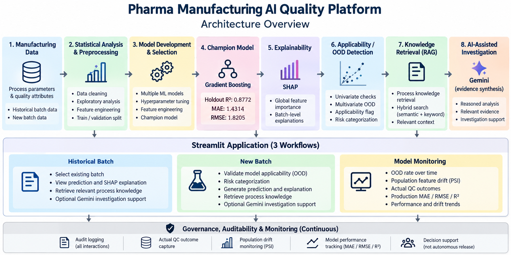

# Pharma Manufacturing AI Quality Platform


An end-to-end AI decision-support platform for pharmaceutical manufacturing quality assessment.


The system combines machine learning, explainability, model applicability, knowledge retrieval, AI-assisted investigation, auditability, and post-deployment monitoring.

## Architecture



## Key Capabilities


- Automated comparison and validation of multiple ML models

- Batch quality prediction using a tuned Gradient Boosting model

- Batch-level SHAP explanation of key model drivers

- Univariate + multivariate applicability/OOD assessment

- Hybrid RAG using manufacturing process knowledge and governance guardrails

- Optional Gemini-based grounded evidence synthesis

- Audit logging and actual QC outcome capture

- Population drift (PSI) and production model performance monitoring


## Model Performance


| Model | Validation R² |

|---|---:|

| Gradient Boosting | \*\*0.8762\*\* |

| MLP | 0.8645 |

| Random Forest | 0.8604 |

| Extra Trees | 0.8590 |


**Champion Model — Gradient Boosting**


| Holdout R² | MAE | RMSE |

|---:|---:|---:|

| \*\*0.8772\*\* | \*\*1.4314\*\* | \*\*1.8205\*\* |


\## Platform Workflows


\*\*Historical Batch\*\* — Analyze existing batches using prediction, SHAP, process knowledge, and investigation support.


\*\*New Batch\*\* — Validate model applicability before generating and explaining predictions for unseen process conditions.


\*\*Model Monitoring\*\* — Track OOD rate, population feature drift, actual QC outcomes, and production MAE/RMSE/R².


\## Tech Stack


`Python` · `scikit-learn` · `SHAP` · `Pandas` · `Sentence Transformers` · `Gemini` · `Streamlit`


\## Governance


The platform is designed for \*\*decision support\*\*, not autonomous batch disposition.


Model explanations indicate model behavior, not scientific causation. Risk categories and monitoring thresholds are demonstration-level and are not validated GMP release criteria.


\## Run Locally


```bash

pip install -r requirements.txt

streamlit run app.py

